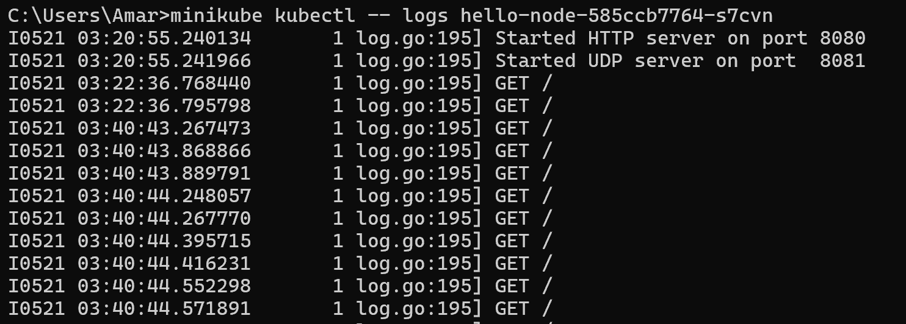
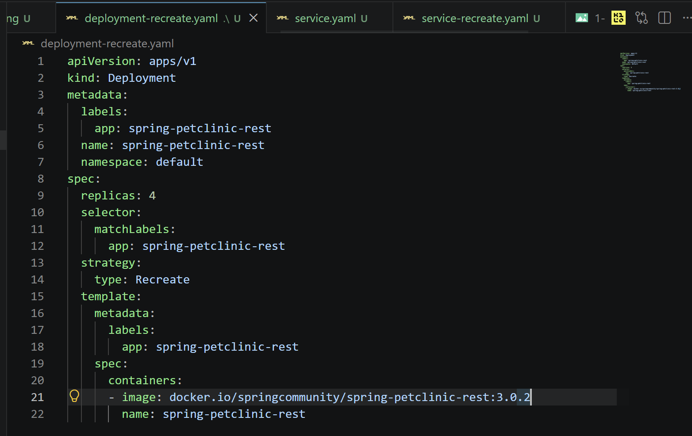
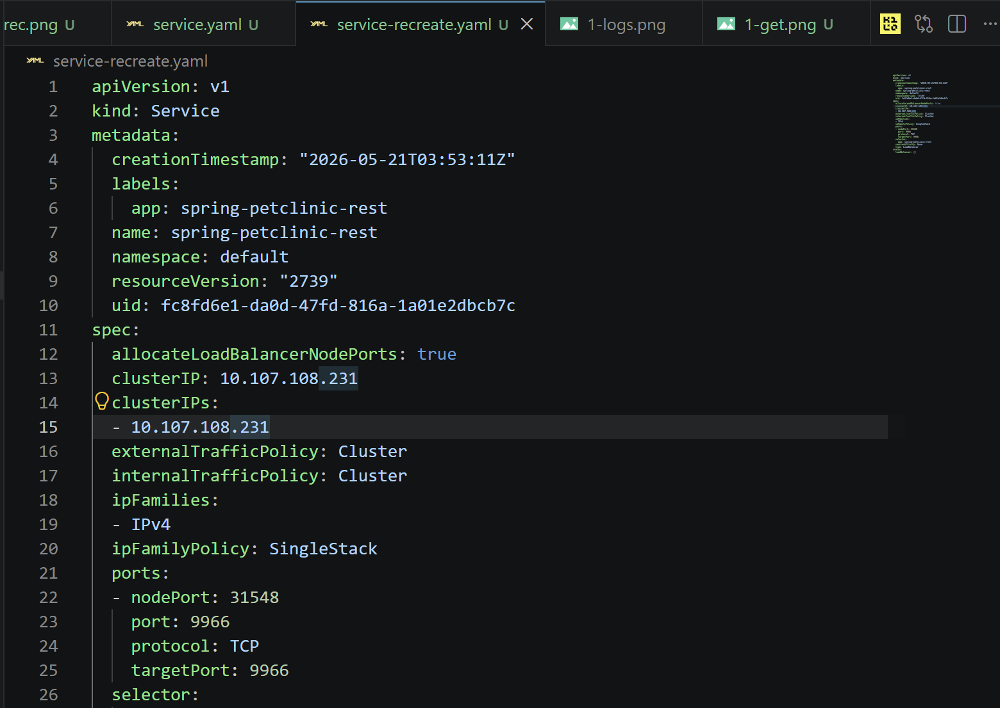
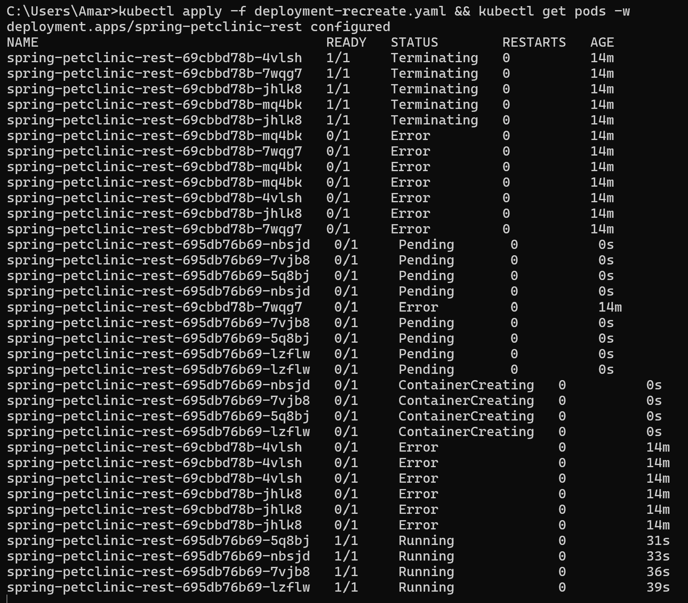

# Reflection on Hello Minikube

## 1. Compare the application logs before and after you exposed it as a Service.


Sebelum di expose jadi Service, log aplikasi cuma nunjukkin kalau server HTTP dan UDP berhasil dijalankan di port tertentu. Belum ada request dari luar yang masuk ke aplikasi.

Setelah deployment di expose jadi Service dan aku buka aplikasinya lewat minikube service hello-node, log mulai nambah dan muncul request seperti `GET /`. Pas aku refresh atau buka app beberapa kali, jumlah log juga ikut nambah terus. Jadi bisa kelihatan kalau setiap kali aplikasi diakses, request baru bakal tercatat di logs aplikasi.

## 2. Notice that there are two versions of `kubectl get` invocation during this tutorial section. The first does not have any option, while the latter has `-n` option with value set to `kube-system`. What is the purpose of the `-n` option and why did the output not list the pods/services that you explicitly created? 


Option -n dipakai buat menentukan namespace yang mau dilihat di Kubernetes. Jadi waktu pakai -n kube-system, artinya command cuma nampilin resource yang ada di namespace kube-system.

Pod dan service yang aku buat sendiri seperti hello-node nggak muncul karena resource itu otomatis dibuat di namespace default, bukan di kube-system. Sedangkan namespace kube-system biasanya dipakai buat komponen internal Kubernetes seperti metrics-server, kube-dns, dan service sistem lainnya.

# Reflection on Rolling Update & Kubernetes Manifest File

## 1. What is the difference between Rolling Update and Recreate deployment strategy?
Perbedaan utama antara Rolling Update dan Recreate ada pada cara mereka mengganti pod lama dengan pod baru. Strategi Rolling Update akan mengganti pod satu per satu secara bertahap, sehingga aplikasi aku tetap bisa diakses oleh *user* dan tidak mengalami *downtime*. Sebaliknya, strategi Recreate akan mematikan semua pod lama secara serentak terlebih dahulu, lalu membuat pod versi baru, yang menyebabkan aplikasi aku mati sementara waktu (*downtime*) selama proses transisi.

## 2 & 3. Try deploying using Recreate deployment strategy & Prepare different manifest files.
Untuk mencoba strategi Recreate, aku membuat modifikasi pada file manifest `deployment.yaml`. Aku menghapus parameter `rollingUpdate` dan mengubah tipe strateginya. Berikut adalah potongan konfigurasi manifest-nya:
```yaml
  strategy:
    type: Recreate
```
Saat aku meng apply file tersebut, aku mengamati lewat terminal bahwa semua pod versi lama langsung berubah statusnya menjadi Terminating secara bersamaan, baru setelah itu pod versi baru mulai di create. Ini sangat berbeda dengan pengalaman Rolling Update sebelumnya.

### Step 1: Bikin File Manifest Baru
1. buat file deployment-recreate.yaml dan service-recreate.yaml
2. edit file deployment-recreate.yaml utk pakai strategy Recreate dan biar Kubernetes mau jalanin proses update nya gitu, disini aku ganti versi aplikasinya juga.



### Step 2: Eksekusi & Dokumentasi
1. jalanin perintah utk masukin konfigurasi baru:
2. pantauin pod nya utk dokumentasi


## 4. What do you think are the benefits of using Kubernetes manifest files? Recall your experience in deploying the app manually and compare it to your experience when deploying the same app by applying the manifest files (i.e., invoking `kubectl apply -f` command) to the cluster.
Menggunakan file manifest Kubernetes (YAML) ini itu terasa jauh lebih praktis dan rapi dibandingkan mengetik perintah manual satu per satu gituu di terminal. Keuntungan terbesarnya adalah konfigurasi infrastruktur aku menjadi terdokumentasi dengan jelas dan bisa disimpan di dalam version control seperti Git (Infrastructure as Code). Selain itu, jika aku butuh melakukan deployment ulang di cluster yg bener bener baru, aku juga gk perlu mengingat command yg panjang, cukup dengan mengeksekusi kubectl apply -f dan biarkan Kubernetes yg mengatur sisanya.