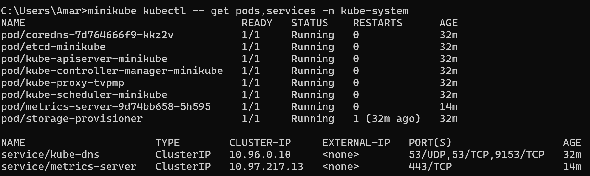

# Reflection on Hello Minikube

## 1. Compare the application logs before and after you exposed it as a Service.

Sebelum di expose jadi Service, log aplikasi cuma nunjukkin kalau server HTTP dan UDP berhasil dijalankan di port tertentu. Belum ada request dari luar yang masuk ke aplikasi.

Setelah deployment di expose jadi Service dan aku buka aplikasinya lewat minikube service hello-node, log mulai nambah dan muncul request seperti `GET /`. Pas aku refresh atau buka app beberapa kali, jumlah log juga ikut nambah terus. Jadi bisa kelihatan kalau setiap kali aplikasi diakses, request baru bakal tercatat di logs aplikasi.

## 2. Notice that there are two versions of `kubectl get` invocation during this tutorial section. The first does not have any option, while the latter has `-n` option with value set to `kube-system`. What is the purpose of the `-n` option and why did the output not list the pods/services that you explicitly created? 

Option -n dipakai buat menentukan namespace yang mau dilihat di Kubernetes. Jadi waktu pakai -n kube-system, artinya command cuma nampilin resource yang ada di namespace kube-system.

Pod dan service yang aku buat sendiri seperti hello-node nggak muncul karena resource itu otomatis dibuat di namespace default, bukan di kube-system. Sedangkan namespace kube-system biasanya dipakai buat komponen internal Kubernetes seperti metrics-server, kube-dns, dan service sistem lainnya.
